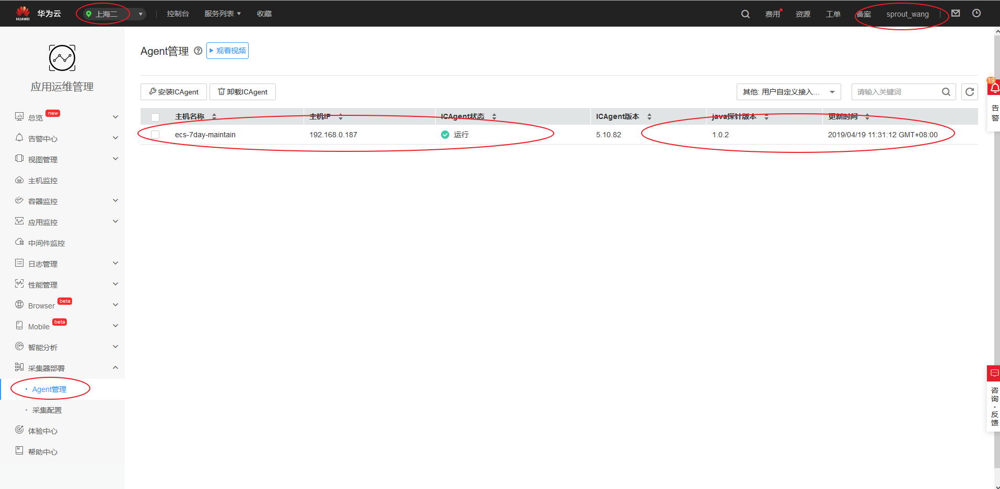
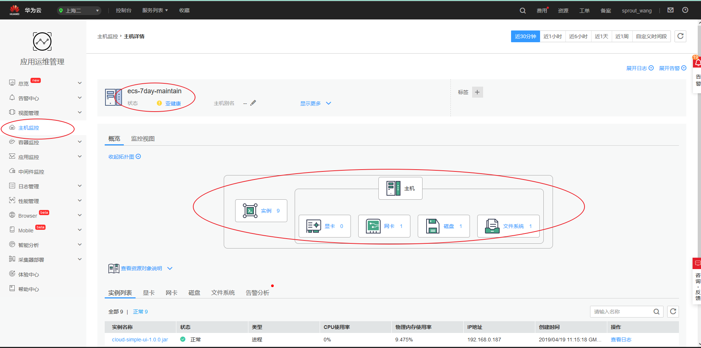
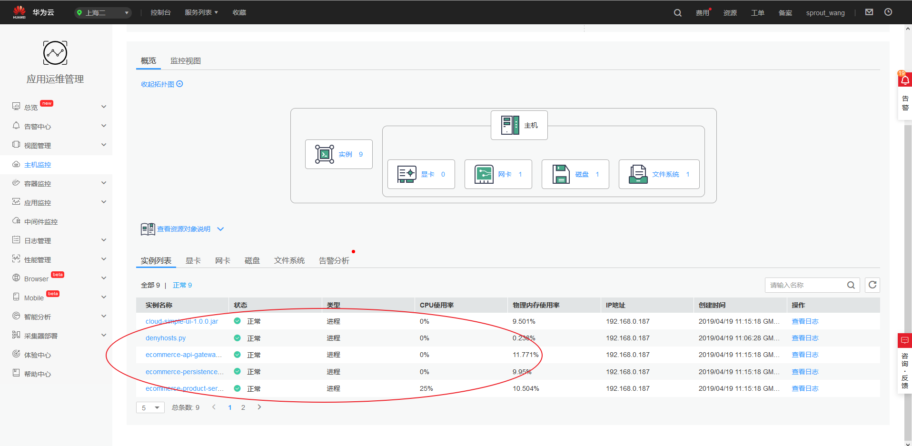
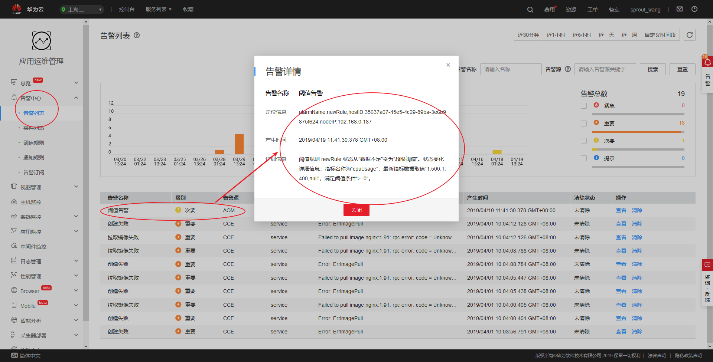
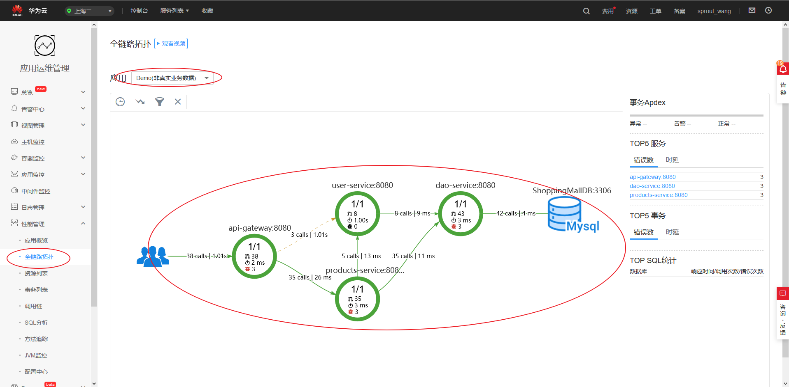

# 课程地址

https://education.huaweicloud.com:8443/courses/course-v1:HuaweiX+CBUCNXP010+Self-paced/courseware/9a89a726d8b0444499433802751c0194/9b9826b1837042f9ba489bb3b9272714/


```
noNeed$@7dayPass2019!.


noNeed$@7dayPass2019!.


noNeed$@7dayPass2019!.


noNeed$@7dayPass2019!.


noNeed$@7dayPass2019!.
```


```
You can now join any number of machines by running the following on each node
as root:

  kubeadm join 192.168.0.252:6443 --token vtijkq.pwd10w3lrrocn5qt --discovery-token-ca-cert-hash sha256:c0df17589a539b28e4ee7861bf728ccdc5c6191976d191edc7fbe702d4f111d5

```


```
Your Kubernetes master has initialized successfully!

To start using your cluster, you need to run the following as a regular user:

  mkdir -p $HOME/.kube
  sudo cp -i /etc/kubernetes/admin.conf $HOME/.kube/config
  sudo chown $(id -u):$(id -g) $HOME/.kube/config

You should now deploy a pod network to the cluster.
Run "kubectl apply -f [podnetwork].yaml" with one of the options listed at:
  https://kubernetes.io/docs/concepts/cluster-administration/addons/

You can now join any number of machines by running the following on each node
as root:

  kubeadm join 192.168.0.252:6443 --token vtijkq.pwd10w3lrrocn5qt --discovery-token-ca-cert-hash sha256:c0df17589a539b28e4ee7861bf728ccdc5c6191976d191edc7fbe702d4f111d5
```


# DAY01
```
@所有人
亲爱的开发者：
欢迎参加华为云【7天转型运维实战营】本期活动将在今天上午11点正式开放！

以下为您今日需要完成的任务列表：

1、点击以下链接接收今日课程内容
https://education.huaweicloud.com:8443/courses/course-v1:HuaweiX+CBUCNXP010+Self-paced/courseware/9a89a726d8b0444499433802751c0194/9b9826b1837042f9ba489bb3b9272714/

备注：课程资料为您需要了解的理论知识，操作指导将引导协助您完成今天的打卡作业

2、请点击以下链接完成打卡操作
https://sun.sharedaka.com/v2/habit/share_h5/visit?habitId=2242009&openId=ochvq0CRsYgiTyK9uklgmFERg0Ng&code=2f4229&byUserId=ochvq0CRsYgiTyK9uklgmFERg0Ng

备注：请按要求上传APM和AOM服务的开通截图，完成打卡

3、将打卡成功截图！私信回复！@9号助手
您将获得1元购买华为云资源包的资格
以及抽取华为云定制超大鼠标垫的机会哦

今日课程提示：
今日无视频讲解内容，如您在操作过程中遇到任何问题可以咨询群内华为云产品专家@雪梅
```


# DAY02

```
@所有人
【1元云资源购买链接】
https://account.huaweicloud.com/usercenter/#/buyservice/grainCloud?promotionId=P1904161544331710WXVTKK0UHDDR3&promotionPlanId=PPP19041817144975807Y3YM210Y26R3&solutionCode=promotion.activity.cn-east-2.20190418-164857-741

请务必！务必！务必！先领取满减券再进行操作，否则会引起扣费！
请按照操作指导文档进行操作，镜像那里最好选Centos 7.4 64bit
由于您误操作引起的扣费我们无法补齐的，请知晓！

------------------------
以下为您今日需要完成的任务列表：

1、点击以下链接接收今日课程内容
https://education.huaweicloud.com:8443/courses/course-v1:HuaweiX+CBUCNXP010+Self-paced/courseware/2978478152a64393b646a245e92c4f72/24b616b4d6cf4ae9a508c3059cf44a24/

备注：课程资料为您需要了解的理论知识，操作指导将引导协助您完成今天的打卡作业

2、请点击以下链接完成打卡操作
https://sun.sharedaka.com/v2/habit/share_h5/visit?habitId=2242009&openId=ochvq0CRsYgiTyK9uklgmFERg0Ng&code=2f4229&byUserId=ochvq0CRsYgiTyK9uklgmFERg0Ng

备注：请按要求上传打卡截图，完成打卡
```







# DAY03

```
1元云资源购买链接】
https://account.huaweicloud.com/usercenter/#/buyservice/grainCloud?promotionId=P1904161544331710WXVTKK0UHDDR3&promotionPlanId=PPP19041817144975807Y3YM210Y26R3&solutionCode=promotion.activity.cn-east-2.20190418-164857-741

请务必！务必！务必！先领取满减券再进行操作，否则会引起扣费！
请按照操作指导文档进行操作，由于您误操作引起的扣费我们无法补齐的，请知晓！
请按照操作指导文档进行操作，镜像那里最好选Centos 7.4 64bit

------------------------
以下为您今日需要完成的任务列表：

1、点击以下链接接收今日课程内容
https://education.huaweicloud.com:8443/courses/course-v1:HuaweiX+CBUCNXP010+Self-paced/courseware/9a89a726d8b0444499433802751c0194/9b9826b1837042f9ba489bb3b9272714/

备注：课程资料为您需要了解的理论知识，操作指导将引导协助您完成今天的打卡作业

2、请点击以下链接完成打卡操作
https://sun.sharedaka.com/v2/habit/share_h5/visit?habitId=2242009&openId=ochvq0CRsYgiTyK9uklgmFERg0Ng&code=2f4229&byUserId=ochvq0CRsYgiTyK9uklgmFERg0Ng

备注：请按要求上传打卡截图，完成打卡
```

